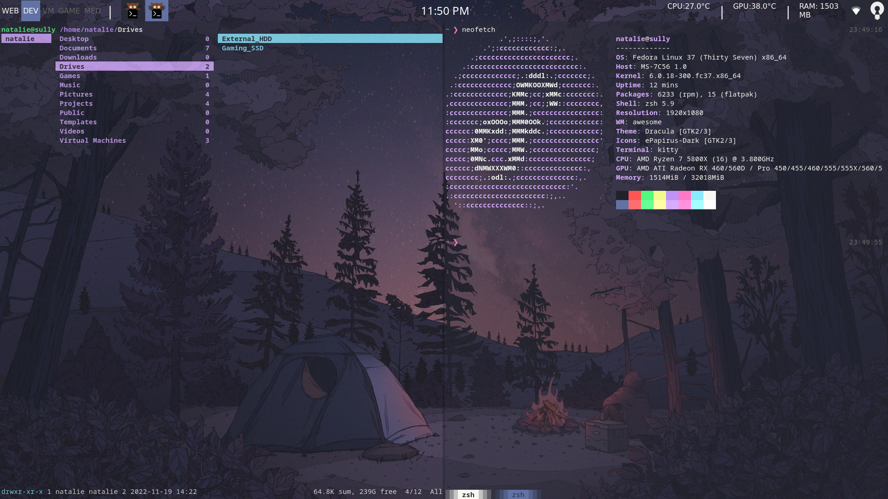
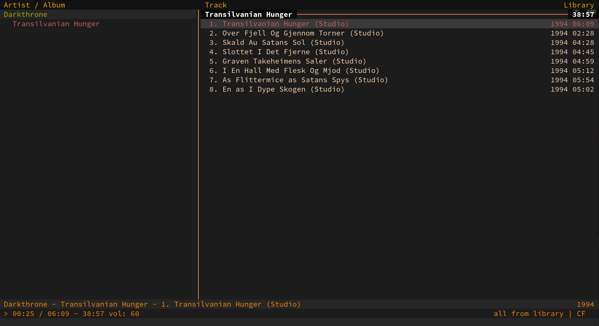
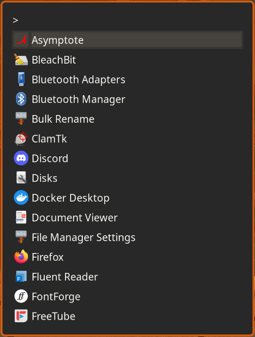
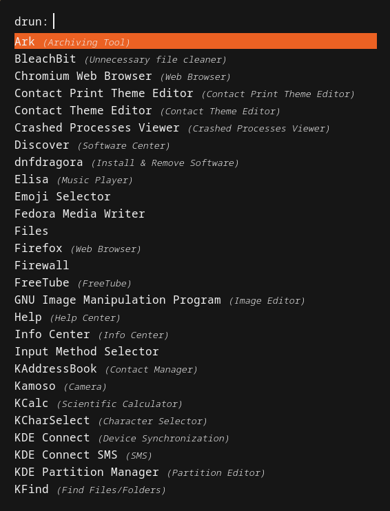
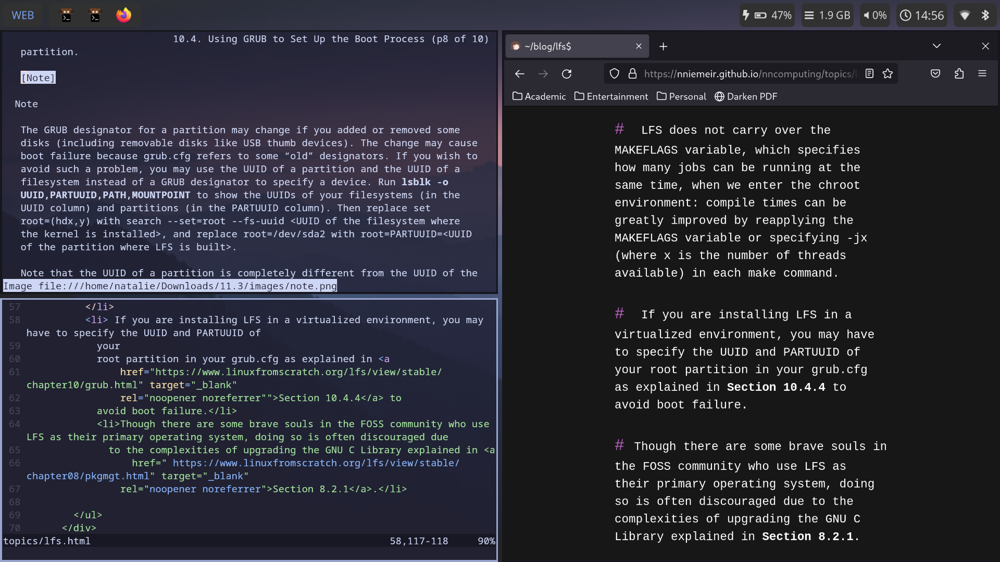

# .files
These are my configuration files for various applications that I use. 

### Linux
* AwesomeWM
* Cmus
* Dunst
* Hyprland
* Kitty
* NVIM
* Picom
* Ranger
* Rofi
* Sway
* VIM
* Waybar
* ZSH

### Windows
* AutoHotKey

#### Application Themes Included:
##### Personal Theme (AwesomeWM)

##### Spooky (Cmus) - forked from Gruvbox

##### Gruvish (Rofi) - forked from Dracula

##### Spooky (Rofi) - forked from Pop-Dark

##### Personal Theme (Sway)

