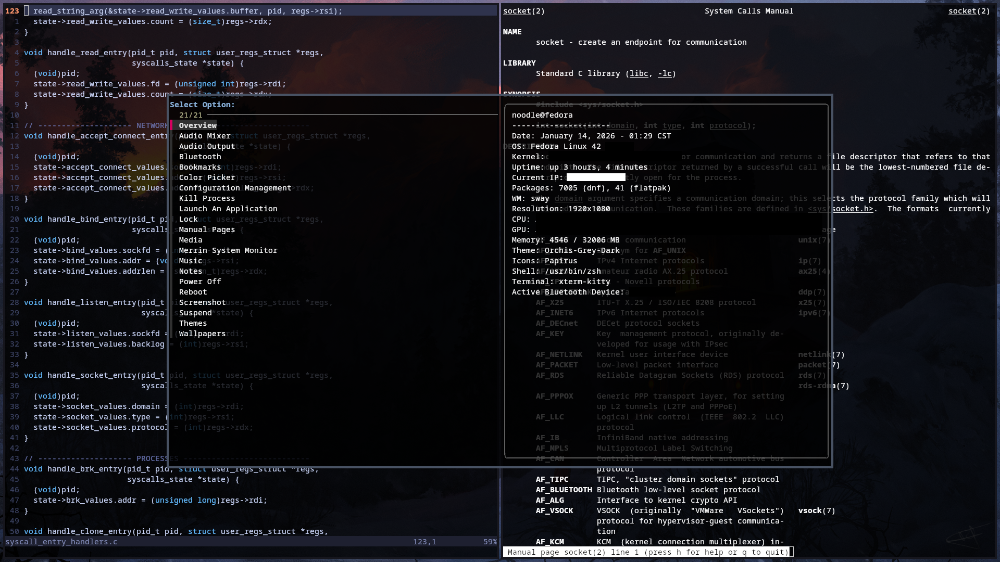

# .files
These are my configuration files for various applications I use on GNU/Linux and Windows, including:
* [AutoHotkey](https://github.com/AutoHotkey/AutoHotkey)
* [FilmFS](https://github.com/nniemeir/filmfs)
* [Fzf](https://github.com/junegunn/fzf)
* [GlazeWM](https://github.com/glzr-io/glazewm)
* [Kitty](https://github.com/kovidgoyal/kitty)
* [Neovim](https://github.com/neovim/neovim)
* [Ranger](https://github.com/ranger/ranger)
* [Sway](https://github.com/swaywm/sway)
* [Zathura](https://github.com/pwmt/zathura)
* [ZSH](https://github.com/zsh-users/zsh)

[Sway (Linux) Keybindings](SWAY_KEYBINDINGS.md)

[Windows Keybindings](WINDOWS_KEYBINDINGS.md)

## Installation
1. Clone the repository into your home directory
``` 
git clone https://github.com/nniemeir/dotfiles ~/.dotfiles
```

The setup scripts create symbolic links to these dotfiles in the corresponding directories.

2. Ensure script execution permissions
* Windows:
```
Set-ExecutionPolicy unrestricted -scope process
```
* Linux:
```
chmod +x setup.sh
```
3. Run the corresponding script.
* Windows:
```
.\setup.ps1
```
* Linux:
```
./setup.sh
```

## Sway Theme


## License
GNU General Public License V2

Copyright (c) 2026 Jacob Niemeir
